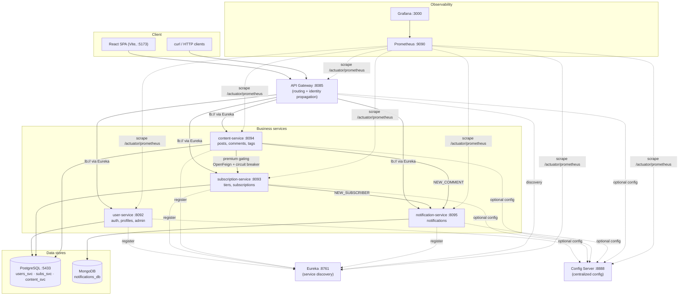
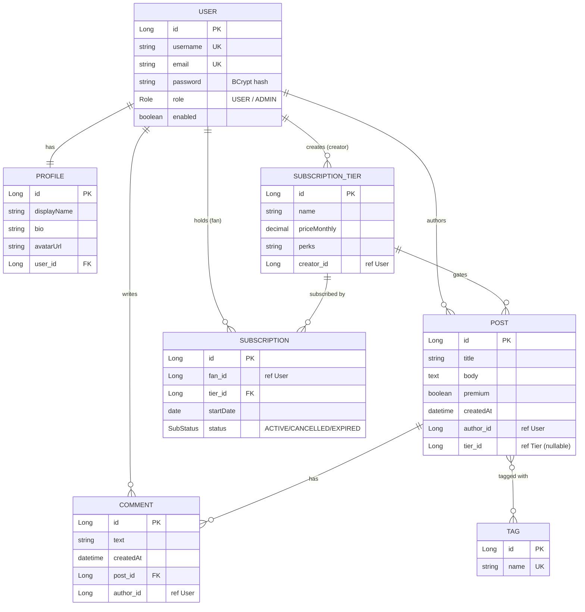

# CreatorHub

> A creator-subscriptions platform (in the spirit of Patreon / Fanvue), built first
> as a clean Spring Boot **monolith** and then decomposed into **Spring Cloud
> microservices** — with a React frontend, full observability, and Docker Compose
> deployment.


> University project — *Aplicații Web cu Arhitectură de Microservicii* — built to
> production quality. Repository: <https://github.com/Carol7237/CreatorHub>

---

## Table of contents

1. [Overview](#1-overview)
2. [Architecture](#2-architecture)
3. [Tech stack](#3-tech-stack)
4. [Data model (ER diagram)](#4-data-model-er-diagram)
5. [Getting started (setup & run)](#5-getting-started-setup--run)
6. [Feature demonstrations](#6-feature-demonstrations)
7. [API documentation](#7-api-documentation)
8. [Testing](#8-testing)
9. [Security](#9-security)
10. [Monitoring & observability](#10-monitoring--observability)
11. [Screenshots](#11-screenshots)
12. [AI in development](#12-ai-in-development)
13. [Author & contributions](#13-author--contributions)
14. [Roadmap / next steps](#14-roadmap--next-steps)

---

## 1. Overview

**CreatorHub** is a creator-subscriptions platform. Creators publish **free** and
**premium** content; fans subscribe to paid **tiers**, unlock premium posts (gated),
comment, and receive **notifications** when something happens (a new subscriber, a
new comment).

The project was built with a deliberate strategy — **monolith first, microservices
last**:

1. A complete, well-structured **Spring Boot monolith** (in [`src/`](src)) with a full
   JPA model, service layer, Spring Security, validation, REST API, and a **React**
   single-page frontend (in [`frontend/`](frontend)).
2. That monolith was then **decomposed into Spring Cloud microservices** (in
   [`services/`](services)): service discovery, an API gateway, a config server, four
   business services, two databases (SQL + NoSQL), resilient inter-service calls, and
   a Prometheus + Grafana monitoring stack.

The monolith remains intact as a reference; the microservices are the main
deliverable. The full design journal lives in [`CLAUDE.md`](CLAUDE.md) (sections
§1–§23) and the step-by-step plan in [`NEXT_STEPS.md`](NEXT_STEPS.md).

---

## 2. Architecture

A single **API Gateway** is the only entry point. It discovers backend services
through **Eureka** and load-balances across them. Each business service owns its own
data (schema-per-service in PostgreSQL, or a MongoDB database). Premium gating is a
resilient inter-service call; events fan out to the notification service.



### Services

| Service | Port | Responsibility | Data store |
|---|---|---|---|
| **api-gateway** | 8085 | Single entry point; routes by path to services via Eureka; injects trusted identity headers | — |
| **eureka-server** | 8761 | Service discovery / registry | — |
| **config-server** | 8888 | Centralized configuration (native backend) | — |
| **user-service** | 8092 | User + Profile, authentication/security, creators browsing, admin | PostgreSQL `users_svc` |
| **subscription-service** | 8093 | SubscriptionTier + Subscription; internal gating endpoint | PostgreSQL `subs_svc` |
| **content-service** | 8094 | Post + Comment + Tag; premium gating; load-balancing demo | PostgreSQL `content_svc` |
| **notification-service** | 8095 | Notifications (event-driven, best-effort) | MongoDB `notifications_db` |

> The legacy **monolith** ([`src/`](src)) runs on **8081** and is an alternative way
> to run the whole app in one process (see [Getting started](#5-getting-started-setup--run)).

### Key architecture decisions

- **Monolith-first, then decomposition** — the domain model and business rules were
  proven in a monolith, then migrated service-by-service (no big-bang rewrite).
- **Schema-per-service** — each relational service owns its own PostgreSQL schema
  (`users_svc`, `subs_svc`, `content_svc`) in a shared database; cross-service
  references are by **id only** (no cross-service foreign keys). Notifications use
  **MongoDB** (a natural NoSQL fit for relation-free, append-style documents).
- **Gateway-injected identity (anti-spoofing)** — the gateway is the single source of
  truth for identity: it authenticates the session, **strips any client-supplied
  `X-User-*` headers**, and injects trusted `X-User-Id` / `X-User-Roles`. Downstream
  services are stateless and read identity from those headers. (Distributed JWT is the
  planned evolution; the gateway filter would simply validate the token instead.)
- **Resilient inter-service calls** — content→subscription gating uses **OpenFeign +
  Resilience4j circuit breaker**. The premium-gating fallback is **fail-closed** (when
  in doubt, lock the post); the notification fallback is **fail-open** (a missed
  notification must never block a subscription or comment).
- **Robust centralized config** — services import config with `optional:configserver:…`
  so they still start on local config if the Config Server is unavailable.

---

## 3. Tech stack

| Area | Technologies |
|---|---|
| Language / runtime | **Java 21** (Temurin) |
| Framework | **Spring Boot 3.5.x**, **Spring Cloud 2025.0.0** |
| Cloud | Eureka (discovery), Spring Cloud Gateway, Config Server, OpenFeign, Spring Cloud LoadBalancer, Spring Cloud CircuitBreaker (**Resilience4j**) |
| Security | Spring Security (session + BCrypt + CSRF + roles; header-based identity downstream) |
| Persistence | Spring Data JPA + **PostgreSQL 16**; Spring Data MongoDB + **MongoDB 7** |
| Observability | Micrometer + **Prometheus** + **Grafana**; Spring Boot Actuator |
| API docs | springdoc-openapi (**Swagger UI**) |
| Build & run | **Maven** (wrapper), **Docker** + **Docker Compose** |
| Testing | JUnit 5, Mockito, AssertJ, Spring Test, **H2**, **JaCoCo** |
| Frontend | **React 18** + **TypeScript** + **Vite**, React Router, TanStack Query, Framer Motion, React Hook Form |

---

## 4. Data model (ER diagram)

The domain has **7 entities** (+ a `post_tags` join table) and two enums (`Role`,
`SubStatus`). In the monolith they form one relational model; in the microservices
they are **distributed across services** and linked by **id** (no cross-service FKs):

| Entities | Owned by | Store |
|---|---|---|
| `User`, `Profile` | user-service | `users_svc` |
| `SubscriptionTier`, `Subscription` | subscription-service | `subs_svc` |
| `Post`, `Comment`, `Tag` | content-service | `content_svc` |
| `Notification` | notification-service | MongoDB `notifications_db` |



> `Notification` (MongoDB) is a standalone document: `recipientId`, `type`
> (`NEW_SUBSCRIBER` / `NEW_COMMENT`), `message`, `actorId`, `relatedId`, `read`,
> `createdAt`.

---

## 5. Getting started (setup & run)

### Prerequisites

- **Java 21** (JDK)
- **Docker Desktop** (Compose v2)
- **Node.js 18+** (only for the React frontend)
- Maven is **not** required — the project ships the Maven Wrapper (`mvnw` / `mvnw.cmd`).

### Option A — full microservices stack with Docker Compose (recommended)

One command builds and starts PostgreSQL, MongoDB, Eureka, the Config Server, all four
business services, the gateway, Prometheus and Grafana:

```bash
# the stack ships its own PostgreSQL on host port 5433 — stop a standalone one first:
docker stop creatorhub-postgres   # ignore the error if it isn't running

docker compose -f services/docker-compose.yml up -d --build
docker compose -f services/docker-compose.yml ps        # watch services become healthy
```

Exposed on the host:

| URL | What |
|---|---|
| <http://localhost:8085> | **API Gateway** (single entry point) |
| <http://localhost:8761> | Eureka dashboard (all services `UP`) |
| <http://localhost:8888> | Config Server (`/<service>/default` serves config) |
| <http://localhost:9090> | Prometheus (Status → Targets) |
| <http://localhost:3000> | Grafana (`admin` / `admin`) |

> **Note:** right after startup the gateway needs ~30 s to refresh its service
> registry — the first calls may return `503` until it sees the instances, then `200`.

Stop everything:

```bash
docker compose -f services/docker-compose.yml down       # add -v to also drop volumes
```

### Option B — the React frontend (dev)

The SPA currently targets the monolith on `:8081`. Run it alongside the monolith
(Option C) for a full UI experience:

```bash
cd frontend
npm install
npm run dev          # http://localhost:5173
```

### Option C — the monolith (single process)

```bash
docker compose up -d                 # PostgreSQL (5433) + MongoDB (root infra)
./mvnw spring-boot:run               # monolith on :8081 (profile dev)   (Windows: mvnw.cmd)
```

### Credentials & ports

- **Dev admin** (seeded on the `dev` profile only): `admin` / `admin123`.
- **Grafana**: `admin` / `admin` (dev).
- **PostgreSQL**: host `5433` → container `5432`, db/user/pass `creatorhub`.
  If a native PostgreSQL occupies `5433`, stop it before starting a stack that ships
  its own database.

> **Live deployment:** not deployed to a public host yet (planned — see
> [Roadmap](#14-roadmap--next-steps)). The Docker Compose stack above is the primary,
> reproducible way to run the whole system.

---

## 6. Feature demonstrations

All commands target the gateway at `http://localhost:8085`. PowerShell users can run
the `curl` loops with `1..N | %{ curl.exe ... }`.

- **Premium gating (inter-service call).** Create a tier and a premium post, have a fan
  subscribe, then `GET /api/posts/{id}`: the subscribed fan sees the `body`
  (`locked:false`); an anonymous/non-subscribed viewer gets `locked:true` with no body;
  the author and admins always see it.
- **Load balancing (round-robin).** Scale a service and watch requests alternate
  between instances:
  ```bash
  docker compose -f services/docker-compose.yml up -d --scale content-service=2
  # both register under CONTENT-SERVICE in Eureka; instanceId alternates 50/50:
  curl http://localhost:8085/api/content/instance     # run ~12 times
  ```
- **Resilience (circuit breaker, fail-closed).** `docker stop creatorhub-subscription`,
  then request a premium post as a subscribed fan → it stays **`locked:true`, HTTP 200**
  (no 500, no cascade). The `subscriptionAccess` breaker trips to `open` — visible in
  Grafana (`resilience4j_circuitbreaker_state`).
- **Notifications (event-driven, fail-open).** A subscription creates a `NEW_SUBSCRIBER`
  notification for the creator; a comment creates a `NEW_COMMENT`. Stop the notification
  service and the subscription/comment still succeed (the notification is best-effort).
- **Centralized config.** `curl http://localhost:8888/content-service/default` returns
  the served config; `curl http://localhost:8085/api/content/instance` shows
  `"configSource":"Spring Cloud Config Server (centralized…)"` — a property defined
  **only** in the Config Server, proving the service consumed it.
- **Monitoring.** Prometheus → Status → Targets (all `UP`); Grafana → "CreatorHub —
  Microservices Overview" dashboard.

---

## 7. API documentation

All client traffic goes through the **gateway (`:8085`)**, which routes by path:

| Path prefix | Service |
|---|---|
| `/api/auth/**`, `/api/creators/**`, `/api/profiles/**`, `/api/admin/**` | user-service |
| `/api/tiers/**`, `/api/subscriptions/**` | subscription-service |
| `/api/posts/**`, `/api/comments/**`, `/api/tags/**`, `/api/content/**` | content-service |
| `/api/notifications/**` | notification-service |

**Swagger UI / OpenAPI** is available per business service (springdoc) when the service
is directly reachable — e.g. running locally, `http://localhost:8092/swagger-ui.html`
(user), `:8093` (subscription), `:8094` (content), `:8095` (notification). The monolith
exposes it at `http://localhost:8081/swagger-ui.html`.

### Main endpoints

| Method & path | Access | Purpose |
|---|---|---|
| `POST /api/auth/register` | public | create a `USER` account |
| `POST /api/auth/login` · `GET /api/auth/csrf` | public | log in (session) · CSRF bootstrap |
| `GET /api/auth/me` · `POST /api/auth/logout` | auth | current user · log out |
| `GET /api/creators` · `/{id}` | public | browse creators |
| `GET /api/profiles/{id}` · `/user/{userId}` | public | view a profile |
| `PUT /api/profiles/{id}` | owner/admin | update a profile |
| `GET /api/tiers` (`?creatorId=`) · `/{id}` | public/auth | browse tiers |
| `POST /api/tiers` · `PUT/DELETE /{id}` | auth · owner/admin | manage tiers |
| `GET /api/subscriptions` | auth | my subscriptions |
| `POST /api/subscriptions` · `POST /{id}/cancel` · `DELETE /{id}` | auth · owner/admin | subscribe / cancel |
| `GET /api/posts` (paged, gated) · `/{id}` · `/{id}/comments` (`?creatorId=`) | public | browse posts (premium bodies locked) |
| `POST /api/posts` · `PUT/DELETE /{id}` | auth · owner/admin | manage posts |
| `POST /api/comments` · `PUT/DELETE /{id}` | auth · owner/admin | comment (premium posts require access) |
| `GET /api/tags` · `/{id}` | public | browse tags |
| `POST /api/tags` · `DELETE /{id}` | auth · ADMIN | manage tags |
| `GET /api/notifications` · `/unread-count` | auth | my notifications |
| `POST /api/notifications/{id}/read` · `/read-all` | auth | mark read |
| `GET /api/admin/users` · `DELETE /{id}` | ADMIN | admin user management |
| `GET /api/content/instance` | public | load-balancing demo (reports the serving instance) |

Error responses are a uniform JSON body (`timestamp`, `status`, `error`, `message`,
`path`, and `fieldErrors` for validation failures).

---

## 8. Testing

```bash
./mvnw -f services/pom.xml clean verify     # microservices: build + run all tests
./mvnw clean verify                         # monolith: tests + JaCoCo coverage gate
```

- **Microservices:** **68 tests** across the services (user 28, subscription 14,
  content 19, notification 7) — Mockito **unit tests** (no DB) for the business rules,
  plus **MockMvc integration tests** on **H2** for security/authorization. The config
  client and Eureka are disabled in the `test` profile (isolated, no Docker needed).
- **Monolith:** **105 tests** (64 Mockito unit + integration on H2), with a **JaCoCo**
  gate of 70% line coverage on the service layer (achieved **~87%**).

Unit tests mock repositories; integration tests use **H2** in `MODE=PostgreSQL` — no
Docker required to run the test suite.

---

## 9. Security

- **Authentication (user-service / monolith):** database-backed, **session**-based,
  **BCrypt** passwords, **CSRF** (cookie-based, SPA-friendly), role-based authorization
  (`USER` / `ADMIN`), token-based remember-me. Exposed over REST so the SPA consumes the
  same endpoints. Self-registration only ever creates `USER` accounts.
- **Distributed identity (microservices):** the **gateway** authenticates the session,
  **strips any client-supplied `X-User-*` headers** (anti-spoofing), and injects trusted
  `X-User-Id` / `X-User-Roles`. Stateless downstream services read identity from those
  headers; ownership/role checks (`@PreAuthorize`, URL rules) work unchanged.
- **Premium gating** is enforced in the service layer (not by URL) via the resilient
  content→subscription call.
- Credentials in this repo are **development-only** (documented dev admin, dev DB/Grafana
  passwords). **Distributed JWT** is the planned next step (the foundation —
  `CustomUserDetailsService` + `PasswordEncoder` — is reused unchanged).

---

## 10. Monitoring & observability

Every service exposes metrics via Actuator + Micrometer at `/actuator/prometheus`
(internal only — **not** routed by the gateway). **Prometheus** (`:9090`) scrapes them;
**Grafana** (`:3000`, `admin`/`admin`) visualizes them with an auto-provisioned data
source and the **"CreatorHub — Microservices Overview"** dashboard:

- HTTP request rate and p95 latency per service, JVM heap, target health.
- **Resilience4j circuit-breaker state** (`resilience4j_circuitbreaker_state`) — stop
  `subscription-service`, hit a premium post, and watch the `subscriptionAccess` breaker
  flip from `closed` to `open` live.

---

## 11. Screenshots

Screenshots live under [`docs/screenshots/`](docs/screenshots) and are referenced
below. *(To be added by the author — captures from a running instance.)*

| File | What to capture |
|---|---|
| `feed.png` | React feed page (cyberpunk theme) with free + premium posts |
| `login.png` | Login page |
| `premium-locked.png` | A premium post card with the locked/blur overlay (the highlight) |
| `post-detail.png` | Post detail + comments |
| `eureka.png` | Eureka dashboard showing all services `UP` (incl. 2 content-service instances) |
| `grafana.png` | Grafana dashboard with request rate / circuit-breaker panels |
| `prometheus-targets.png` | Prometheus → Status → Targets, all `UP` |
| `swagger.png` | Swagger UI of one service |
| `config-server.png` | `GET http://localhost:8888/content-service/default` JSON response |
| `load-balancing.png` | Terminal output of the round-robin `instanceId` alternating |

```markdown
<!-- example, once the images exist:


-->
```

---

## 12. AI in development

This project was built using **Claude Code** as an AI pair-programmer, directed by the
author. The working model was deliberate:

- **The author (architect):** owned all architecture and design decisions — the
  monolith-first strategy, service boundaries, schema-per-service, the gateway identity
  mechanism (and its anti-spoofing requirement), the fail-closed vs fail-open trade-offs,
  the config-server approach — and reviewed and validated every step. Major decisions
  (repo structure, data strategy, identity propagation, sync-vs-event-driven) were made
  by the author after the agent presented options and trade-offs.
- **The AI (executor):** implemented the code under that direction, kept commits small
  and conventional, ran builds/tests, verified behavior end-to-end (through the gateway,
  in Docker), and maintained the design journal ([`CLAUDE.md`](CLAUDE.md)).

**Benefits observed:** faster iteration, consistent structure across services, thorough
inline documentation, and disciplined verification at each step (build → run → test →
commit). Using AI agents effectively — keeping a human architect in the loop for
decisions and review — is treated here as a modern engineering skill, not a shortcut.

---

## 13. Author & contributions

**Carol** — sole author, architect and developer.

As the single contributor, the author was responsible for the entire system: the
architecture and all technical decisions, the monolith design and its decomposition
into microservices, the data model, security, resilience and observability design, and
the coordination of the implementation (see [AI in development](#12-ai-in-development)).
The commit history reflects an incremental, phase-by-phase build (~69 commits).

---

## 14. Roadmap / next steps

- **Distributed JWT** — replace gateway session-resolution with JWT validation (the
  downstream header contract stays the same).
- **Redis caching** — cache premium-gating results and cross-service display data.
- **Dynamic config refresh** — a Git/filesystem config backend + `@RefreshScope` +
  `/actuator/refresh` (or Spring Cloud Bus) for live config changes.
- **Asynchronous messaging** — move notifications to a broker (RabbitMQ/Kafka) for a
  fully event-driven, decoupled flow.
- **Containerized frontend + live deployment** — serve the SPA through the gateway and
  deploy the stack to a public host (with externalized, encrypted secrets).

---

*See [`CLAUDE.md`](CLAUDE.md) for the full design journal (§1–§23) and
[`NEXT_STEPS.md`](NEXT_STEPS.md) for the phased build plan.*
